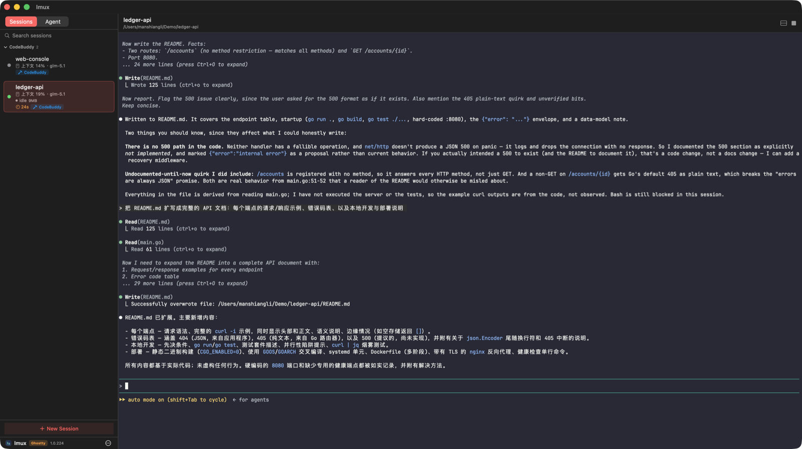

# lmux

> The missing GUI for **CodeBuddy Code** & **Claude Code** — a native macOS
> workbench for running AI coding agents side by side.

[中文说明 (Chinese)](README.zh-CN.md)



lmux gives every agent its own embedded terminal session: launch CodeBuddy and
Claude Code on different tasks, watch each conversation's **context-window and
credit usage** in the sidebar, and **resume conversations exactly where they
left off** — even on a different Mac.

## Why lmux?

- **First-class CodeBuddy Code support** — the only GUI in this space built on
  CodeBuddy's session store: automatic conversation discovery, one-click
  resume, and **exact** context-window and credit accounting. Claude Code gets
  the same treatment with estimated usage.
- **Cross-Mac session sync** — pinned sessions sync incrementally to any folder
  shared between your Macs (iCloud Drive, Syncthing, …). Recorded paths are
  localized on import, and two-sided edits raise a keep-local / use-remote
  dialog instead of silently overwriting.
- **Truly native** — SwiftUI app with a Ghostty GPU-rendered terminal; a
  SwiftTerm backend keeps macOS 12 and Intel Macs supported (`make app-x86`).
- **Local-first** — agents run in local terminals; sessions live in your home
  directory and sync only to folders you own. MIT, no telemetry.

## Install

**Homebrew** (once the tap is published):

```sh
brew tap LiManshiang/lmux
brew install --cask lmux
```

**Manual**: download `lmux.zip` from the latest
[Release](https://github.com/LiManshiang/lmux/releases), unzip, and drag
`lmux.app` into `/Applications`. The build is ad-hoc signed — on first launch,
right-click the app and choose **Open**.

**From source** (macOS 13+, Xcode CLT, Go 1.26+):

```sh
git clone https://github.com/LiManshiang/lmux.git
cd lmux/lmux-app
make app
open .build/lmux.app
```

## Features


- **Multi-session sidebar** — create, rename, search, pin, and switch between
  terminal sessions, each with its own working directory.
- **Embedded agent terminals** — run CodeBuddy (`codebuddy-code`) or Claude
  (`claude`) directly in the app, with per-agent flags and trust handling.
- **Conversation resumption** — sessions remember their agent conversation and
  auto-resume it on reconnect; imported conversations are path-localized so
  resume works on the new machine.
- **Context & credit meter** — the sidebar shows each conversation's
  context-window usage (exact for CodeBuddy, estimated for Claude) and
  estimated credit spent.
- **Agent detection** — launch an agent inside a plain bash session and lmux
  detects it, marks the session, and surfaces its status.
- **Cross-device session sync** — incremental `.lmuxsession` bundles plus raw
  agent JSONL mirroring, with a keep-local / use-remote conflict dialog.
- **Open In menu** — open a session in its own window or jump to its working
  directory in Finder.
- **Split terminal** — a second terminal pane below the main one.
- **Keyboard shortcuts** — `⌘F` search, `⌘↑/⌘↓` switch sessions, `⌘K` stop,
  `⌘N` new.
- **Export / Import** — full migration (sessions + agent conversation data) to
  another Mac via tar.gz archives.

## FAQ

**What is CodeBuddy Code?**
Tencent's AI coding CLI (the `codebuddy-code` agent). lmux is currently the
only open-source GUI built around its session format.

**Do agents run in the cloud?**
No. lmux spawns the CLI binaries already installed on your Mac inside local
terminals. Code and conversations stay on your machine unless you enable
session sync to a folder you own.

**How is this different from tmux plus a few terminal windows?**
Session↔conversation binding, automatic resume, per-conversation context and
credit accounting, and cross-Mac sync — none of which a plain terminal
multiplexer knows about.

<details>
<summary><strong>Build from source / Architecture</strong></summary>

### Requirements

- macOS 13+ (Ghostty GPU rendering backend), or macOS 12+ with the SwiftTerm
  backend (Intel x86_64 builds via `make app-x86`)
- Xcode command line tools (`xcode-select --install`)
- Go 1.26+ (backend)

### Dependencies

This project depends on [SwiftTerm](https://github.com/migueldeicaza/SwiftTerm)
(MIT). The embedded terminal uses a **Swift 5.7 backport** of SwiftTerm; the
patch is included in this repository:

```sh
git clone https://github.com/migueldeicaza/SwiftTerm.git
cd SwiftTerm
git checkout 4acb12f   # upstream commit the patch is based on
git apply ../lmux-app/tools/patches/swiftterm-5.7-backport.patch
```

The `libghostty-spm` package is resolved the same way (pinned to upstream
commit `31884f5` of `Lakr233/libghostty-spm`).

### Build

One code line, two app products (same Swift sources; Ghostty-specific code is
behind `#if canImport(GhosttyTerminal)`):

```sh
cd lmux-app
make test                   # unit tests (arch -arm64; avoids Rosetta x86 .build pollution)
make app                    # lmux.app    — Ghostty renderer, macOS 13+ (.build/lmux.app)
make app-st                 # lmux-st.app — SwiftTerm renderer, macOS 12 (.build-st/lmux-st.app)
make app-x86                # lmux-st.app — x86_64 Intel + SwiftTerm + macOS 12
```

- `make app-st` temporarily swaps `Package.st.swift` over `Package.swift`
  (trap-restored) and builds into a separate `.build-st` scratch path, so the
  two variants never pollute each other.
- The backend binary is a **build product, not tracked in git**: every app*
  target rebuilds it via `go build` (falls back to an existing `backend/lmux`
  when Go is missing). New machines need Go installed.

### Tests

```sh
cd lmux-app
make test                   # frontend LMUXCore unit tests (77 cases, arm64)
cd backend-src && go test ./...   # backend unit tests (session CRUD, find-session,
                                  # session-valid fast path, import/export)
```

### Architecture

```
lmux-app/
  Sources/
    LMUX/          # macOS app (SwiftUI + SwiftTerm): views, view model, terminal
    LMUXCore/      # testable core library: AgentProvider protocol, per-agent
                   # providers (codebuddy/claude), session restore
    LMUXCoreTests/ # unit tests
  backend-src/     # Go backend: session store (SQLite), agent scanning,
                   # context/credit stats, REST API (port 19680)
  tools/
    export-lmux.sh # CLI export for migrating to another Mac
    patches/       # SwiftTerm 5.7 backport patch
```

Adding a new agent = a new `AgentProvider` implementation; the main flow
(connect, restore, detection) only depends on the provider protocol.

</details>

## License

[MIT](LICENSE)
