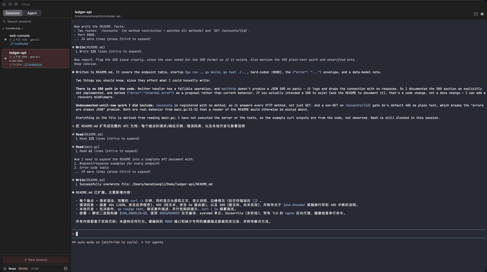
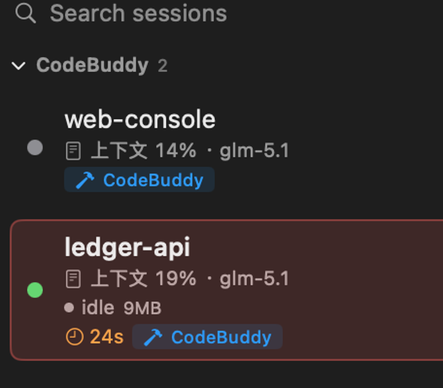
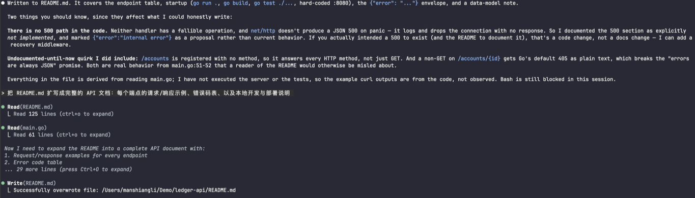

# lmux

[](https://github.com/LiManshiang/lmux/releases)
[](https://github.com/LiManshiang/lmux/actions/workflows/release.yml)
[](#install)
[](LICENSE)

> **CodeBuddy Code** 与 **Claude Code** 的缺失 GUI —— 一个原生 macOS 工作台，
> 让 AI 编码智能体并排运行。

[English](README.md)



lmux 给每个智能体一个独立的嵌入式终端会话：为不同任务分别启动 CodeBuddy 和
Claude Code，在侧边栏查看每个对话的**上下文窗口与积分消耗**，并把对话**精确
恢复到离开时的位置**——换一台 Mac 也一样。

## 为什么选 lmux？

- **一等公民的 CodeBuddy Code 支持** —— 本空间唯一基于 CodeBuddy 会话存储构建
  的 GUI：自动发现对话、一键续接、**精确**的上下文窗口与积分计量（Claude Code
  同样支持，用量为估算值）。
- **跨 Mac 会话同步** —— 置顶会话增量同步到任意在多台 Mac 间共享的目录
  （iCloud Drive、Syncthing 等）。导入时自动把记录的路径本地化；双边都有修改
  时弹出"保留本地 / 使用远端"面板，而不是静默覆盖。
- **真·原生** —— SwiftUI 应用 + Ghostty GPU 渲染终端；SwiftTerm 后端让
  macOS 12 与 Intel Mac 同样受支持（`make app-x86`）。
- **本地优先** —— 智能体跑在本地终端；会话数据保存在你的家目录，同步只写入
  你自己的共享文件夹。MIT 协议，无遥测。

## 安装

**Homebrew**：

```sh
brew tap LiManshiang/lmux
brew trust limanshiang/lmux   # Homebrew 要求显式信任第三方 tap
brew install --cask lmux
```

**手动下载**：从最新的 [Release](https://github.com/LiManshiang/lmux/releases)
下载 `lmux.zip`，解压后把 `lmux.app` 拖入 `/Applications`。构建为 ad-hoc 签名
——首次打开请右键应用并选择**打开**。

**从源码构建**（macOS 13+、Xcode CLT、Go 1.26+）：

```sh
git clone https://github.com/LiManshiang/lmux.git
cd lmux/lmux-app
make app
open .build/lmux.app
```

## 功能特性

<table>
<tr>
<td width="340" valign="top">



</td>
<td valign="top">

- **多会话侧边栏** —— 创建、重命名、搜索、置顶、切换多个终端会话，每个会话
  有独立的工作目录。
- **嵌入式智能体终端** —— 直接在应用内运行 CodeBuddy（`codebuddy-code`）或
  Claude（`claude`），自动处理各自的启动参数与信任配置。
- **会话续接** —— 会话记住自己的智能体对话，重连时自动恢复；导入的对话会做
  路径本地化，在新机器上同样能续接。
- **上下文与积分计量** —— 侧边栏显示每个对话的上下文窗口占用（CodeBuddy
  精确、Claude 估算）与估算积分消耗。
- **智能体检测** —— 在普通 bash 会话中启动智能体时自动识别、标记并展示状态。
- **跨设备会话同步** —— 增量 `.lmuxsession` bundle + 原始 JSONL 镜像，冲突时
  弹出"保留本地 / 使用远端"面板。
- **Open In 菜单** —— 在独立窗口打开会话，或用 Finder 直达会话工作目录。
- **分屏终端** —— 在主终端下方打开第二个终端面板。
- **键盘快捷键** —— `⌘F` 搜索、`⌘↑/⌘↓` 切换会话、`⌘K` 停止、`⌘N` 新建。
- **导出 / 导入** —— 通过 tar.gz 包完整迁移（会话 + 智能体对话数据）。

</td>
</tr>
</table>



## 常见问题

**CodeBuddy Code 是什么？**
腾讯的 AI 编程 CLI（`codebuddy-code` 智能体）。lmux 是目前唯一围绕其会话格式
构建的开源 GUI。

**智能体跑在云端吗？**
不。lmux 启动的是你本机已安装的 CLI，运行在本地终端里。除非你开启会话同步并
指向自己的共享目录，代码与对话不会离开你的电脑。

**和 tmux 加几个终端窗口有什么区别？**
会话↔对话绑定、自动续接、按对话的上下文与积分计量、跨 Mac 同步——这些是一个
纯终端复用器都不具备的。

<details>
<summary><strong>从源码构建 / 架构</strong></summary>

### 环境要求

- macOS 13+（Ghostty GPU 渲染后端），或 macOS 12+ 使用 SwiftTerm 后端（Intel
  x86_64 构建：`make app-x86`）
- Xcode 命令行工具（`xcode-select --install`）
- Go 1.26+（后端）

### 依赖

本项目依赖 [SwiftTerm](https://github.com/migueldeicaza/SwiftTerm)（MIT）。
嵌入式终端使用了 SwiftTerm 的 **Swift 5.7 backport** 补丁，补丁已包含在本仓库：

```sh
git clone https://github.com/migueldeicaza/SwiftTerm.git
cd SwiftTerm
git checkout 4acb12f   # 补丁基于的上游提交
git apply ../lmux-app/tools/patches/swiftterm-5.7-backport.patch
```

`libghostty-spm` 包同样按上游固定版本解析（`Lakr233/libghostty-spm` 的
`31884f5`）。

### 构建

单一代码线、两种产物（Ghostty 相关代码 `#if canImport(GhosttyTerminal)`
条件化）：

```sh
cd lmux-app
make test                   # 单元测试（arch -arm64，规避 Rosetta x86 污染）
make app                    # lmux.app —— Ghostty 渲染，macOS 13+（产物 .build/lmux.app）
make app-st                 # lmux-st.app —— SwiftTerm 渲染，macOS 12（产物 .build-st/lmux-st.app）
make app-x86                # lmux-st.app —— x86_64 Intel + SwiftTerm + macOS 12
```

- `make app-st` 构建期间会临时把 `Package.st.swift` 换成 `Package.swift`
  （trap 自动还原），并独立使用 `.build-st` scratch 目录，不污染常规 `.build`。
- 后端二进制是**构建产物，不入库**：每次 app* 目标都会尝试 `go build`（无 Go
  工具链时复用已有 `backend/lmux`）。新机器需先装 Go。

### 测试

```sh
cd lmux-app
make test                   # 前端 LMUXCore 单元测试（77 用例，arm64）
cd backend-src && go test ./...   # 后端单元测试（会话 CRUD、find-session、
                                  # session-valid 快速路径、导入/导出）
```

### 架构

```
lmux-app/
  Sources/
    LMUX/          # macOS 应用（SwiftUI + SwiftTerm）：视图、ViewModel、终端
    LMUXCore/      # 可测试的核心库：AgentProvider 协议、各智能体实现
                   # （codebuddy/claude）、会话恢复
    LMUXCoreTests/ # 单元测试
  backend-src/     # Go 后端：会话存储（SQLite）、智能体扫描、上下文/积分统计、
                   # REST API（端口 19680）
  tools/
    export-lmux.sh # 迁移到另一台 Mac 的命令行导出脚本
    patches/       # SwiftTerm 5.7 backport 补丁
```

新增一个智能体 = 实现一个 `AgentProvider`；主流程（连接、恢复、检测）只依赖
Provider 协议。

</details>

## 开源许可

[MIT](LICENSE)
